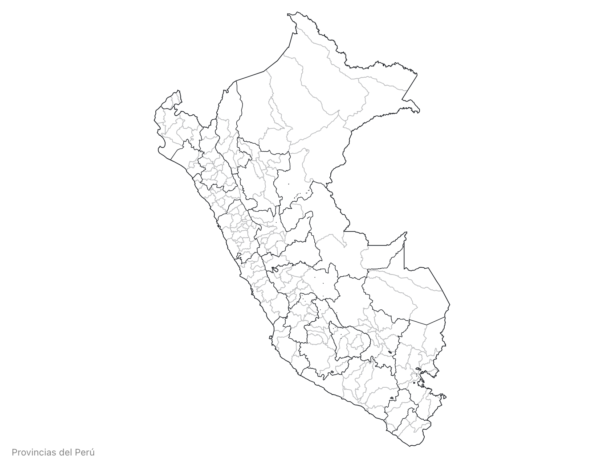
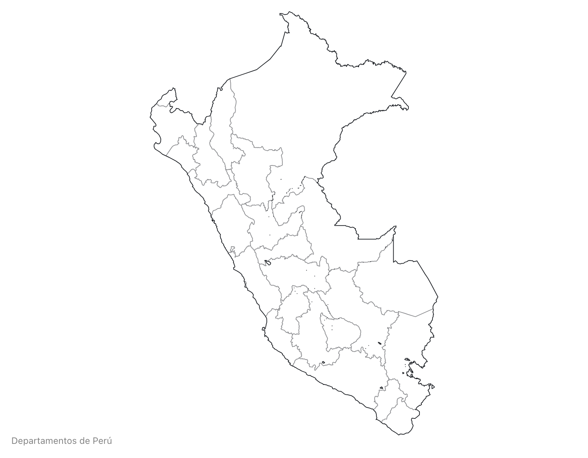

# Perú Atlas TopoJSON

This repository provides a convenient redistribution of the [Perú cartographic boundary shapefiles](https://www.geogpsperu.com/), 2022 edition as vector data. 

### Usage

Yo can see an interactive example in [Observable notebook](https://observablehq.com/d/74241e5a73f974d7?collection=@ccalobeto/peru-insights)

## Generating the files

Clone or download the repo and start a terminal. Since there isn't a web service to directly Download the vector files, download them manually and create and move them into the `build` folder. Then run `npm run prepublishOnly` to transform the zip files into topojson files.

If you need to make further adjustments (projection, simplification, quantization) you can change the `prepublish` config and run `npm run prepublishOnly` again.

### Reference

<a href="#simplification" name="simplification">#</a> <i>simplification</i>

Removes points to reduce the file size. Set to `1e-7` by default.

<a href="#quantization" name="quantization">#</a> <i>quantization</i>

Removes information by reducing the precision of each coordinate. Set to `1e5` by default.

## File Reference

<a href="#districts-100k.json" name="districts-100k.json">#</a> <b>districts-100k.json</b> · [Download](https://cdn.jsdelivr.net/npm/pe-atlas@0.0.1/districts-100k.json "Source")

A [TopoJSON file](https://github.com/topojson/topojson-specification/blob/master/README.md#21-topology-objects) containing three objects: districts, provinces and departments corresponding to [Perú cartographic boundary shapefiles](https://www.geogpsperu.com/).
The geometry is quantized and simplified, but not projected.

<a href="#provinces-100k.json" name="provinces-100k.json">#</a> <b>provinces-100k.json</b> · [Download](https://cdn.jsdelivr.net/npm/pe-atlas@0.0.1/provinces-100k.json "Source")

A [TopoJSON file](https://github.com/topojson/topojson-specification/blob/master/README.md#21-topology-objects) containing the geometry collections <i>provinces</i> and <i>departments</i>. The geometry is quantized and simplified, but not projected. 

<a href="#departments-100k.json" name="departments-10k.json">#</a> <b>departments-100k.json</b> · [Download](https://cdn.jsdelivr.net/npm/pe-atlas@0.0.1/departments-100k.json "Source")

A [TopoJSON file](https://github.com/topojson/topojson-specification/blob/master/README.md#21-topology-objects) containing the geometry collection <i>departments</i>. The geometry is quantized and simplified, but not projected. 

<a href="#districts" name="districts">#</a> *pe*.objects.<b>districts</b>

Each district has two properties:

* *district.id* - the six-digit [UBIGEO code](https://es.wikipedia.org/wiki/Ubigeo), such as `"100902"`
* *district.properties.name* - the district name, such as `"CODO DEL POZUZO"`

The first two digits of the district UBIGEO code is the UBIGEO department code.

<a href="#provinces" name="provinces">#</a> *pe*.objects.<b>provinces</b>

Each province has two properties:

* *province.id* - the four-digit [province code](https://es.wikipedia.org/wiki/Ubigeo), such as `"0101"`
* *province.proprties.name* - the province name, such as `"CHACHAPOYAS"`

<a href="#departments" name="departments">#</a> *pe*.objects.<b>departments</b>

The department has two properties:

* *department.id* - the string `"01"`
* *department.name* - the string `"AMAZONAS"`

### Inspiration

The original idea and implementation comes from Mike Bostock’s [us-atlas](https://github.com/topojson/us-atlas) and [world-atlas](https://github.com/topojson/world-atlas).